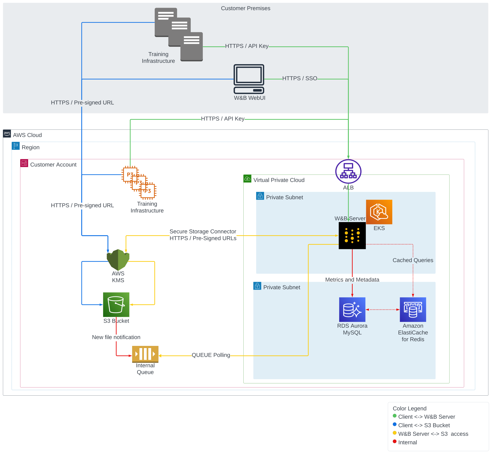
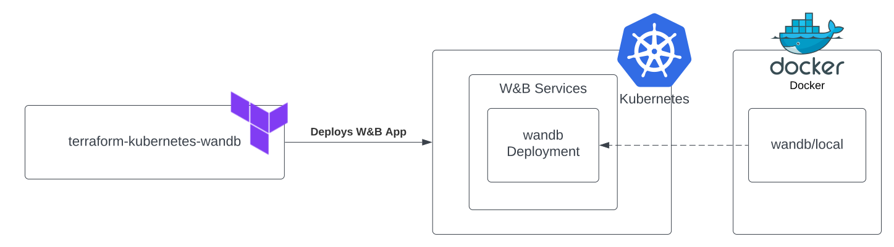
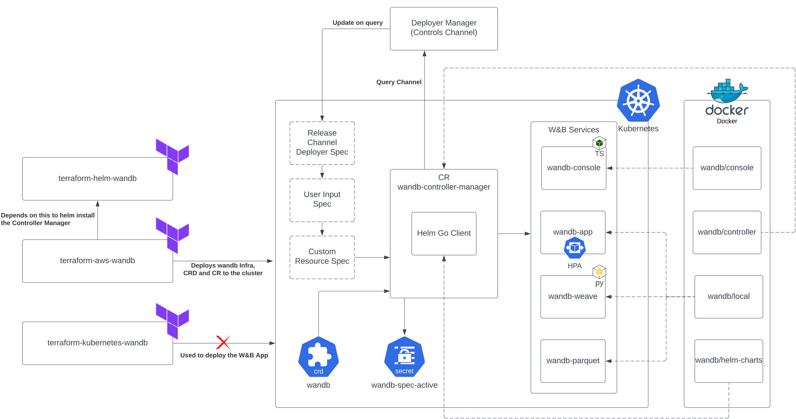
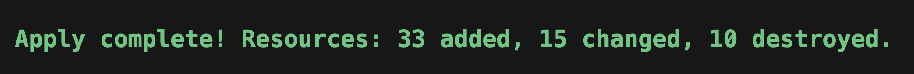

# Operator Migration

This guide details the steps required to upgrade from **_pre-operator_** to **_post-operator_** environments using the [terraform-aws-wandb](https://registry.terraform.io/modules/wandb/wandb/aws/latest) module.

## Introduction to Operator Shift

The transition to a Kubernetes [operator](https://kubernetes.io/docs/concepts/extend-kubernetes/operator/) pattern is crucial for our architecture. This section explains the transition from **_pre_** to **_post_** architectures.

### Reasons for the Architecture Shift

Historically, the W&B application was deployed as a single Deployment and pod within a Kubernetes Cluster or Docker container. We have always recommended externalizing the Metadata Store and Object Store to decouple state from the application, especially in production environments.

As the application grew, the need to evolve from a monolithic container to a distributed system became apparent. This change facilitates backend logic handling and seamlessly introduces **_in-kubernetes_** infrastructure capabilities. It also supports deploying new services essential for additional features that W&B relies on.

Previously, any Kubernetes-related changes required updating the [terraform-kubernetes-wandb](https://github.com/wandb/terraform-kubernetes-wandb), ensuring compatibility across cloud providers, configuring necessary Terraform variables, and executing a terraform apply for each backend or Kubernetes-level change. This process was not scalable and placed a significant burden on our support staff to assist customers with upgrades.

The solution was to implement an **_Operator_** that connects to a central [deploy.wandb.ai](https://deploy.wandb.ai) server with its `license` to request the latest specification changes for a given **_Release Channel_** and apply them. Helm was chosen as both the deployment mechanism for our operator and the means for the operator to handle all configuration templating of the W&B Kubernetes stack; Helmception.

You can install the operator from [charts/operator](https://github.com/wandb/helm-charts/tree/main/charts/operator). This installation creates a deployment called `controller-manager` and utilizes a **_Custom Resource_** definition named `weightsandbiases.apps.wandb.com` (shortName: `wandb`), which takes a single `spec` and applies it to the cluster:

```yaml
apiVersion: apiextensions.k8s.io/v1
kind: CustomResourceDefinition
metadata:
  name: weightsandbiases.apps.wandb.com
```

The `controller-manager` installs [charts/operator-wandb](https://github.com/wandb/helm-charts/tree/main/charts/operator-wandb) based on the spec of the **_Custom Resource_**, **_Release Channel_**, and a **_User Defined Config_** in the new **_System Console_**. This hierarchy allows for maximum configuration flexibility at the user end and enables W&B to release new images, configurations, features, and Helm updates without requiring Terraform reruns.

## Before and After Architecture

Previously, our architecture used:

```hcl
module "wandb_infra" {
  source  = "wandb/wandb/aws"
  version = "1.16.10"
  ...
}
```

to control the infrastructure:



and this module to deploy the W&B application:

```hcl
module "wandb_app" {
  source  = "wandb/wandb/kubernetes"
  version = "1.12.0"
}
```



Post-transition, the architecture uses:

```hcl
module "wandb_infra" {
  source  = "wandb/wandb/aws"
  version = "4.7.2"
  ...
}
```

to manage both the installation of infrastructure and the W&B application to the Kubernetes cluster, thus eliminating the need for the `module "wandb_app"` in `post-operator.tf`.



This architectural shift facilitates the introduction of additional customer features (like OpenTelemetry, Prometheus, HPA's, Kafka, and image updates) without requiring manual Terraform operations by SRE/Infrastructure teams.

### Specification Hierarchy

In our operator model, configuration specifications follow a hierarchical model where higher-level specifications override lower-level ones. Here’s how it works:

- **Release Channel Spec**: This base level configuration sets default values and configurations based on the **_Release Channel_** set by W&B for the deployment.
- **User Input Spec**: Users can override the default settings provided by the Release Channel Spec through the System Console.
- **Custom Resource Spec**: The highest level of specification, which comes from the Terraform configuration. Any values specified here will override both the User Input and Release Channel specifications.

This hierarchical model ensures that configurations are flexible and customizable to meet varying needs while maintaining a manageable and systematic approach to upgrades and changes.

## Migration

To commence with a base installation of the W&B Pre-Operator, ensure that `post-operator.tf` has a `.disabled` file extension and `pre-operator.tf` is active (i.e., does not have a `.disabled` extension).

### Prerequisites

Before initiating the migration process, ensure the following prerequisites are met:

- **AWS Credentials**: Proper AWS credentials configured to interact with your AWS resources.
- **Terraform Installed**: The latest version of Terraform should be installed on your system.
- **Route53 Hosted Zone**: An existing Route53 hosted zone corresponding to the domain under which the application will be served.
- **Pre-Operator Terraform Files**: Ensure `pre-operator.tf` and associated variable files like `pre-operator.tfvars` are correctly set up.

### Pre-Operator Setup

Execute the following Terraform commands to initialize and apply the configuration for the Pre-Operator setup:

```bash
terraform init -upgrade
terraform apply -var-file=./pre-operator.tfvars
```

`pre-operator.tf` should look something like this:

```ini
namespace     = "operator-upgrade"
domain_name   = "sandbox-aws.wandb.ml"
zone_id       = "Z032246913CW32RVRY0WU"
subdomain     = "operator-upgrade"
wandb_license = "ey..."
wandb_version = "0.51.2"
```

The `pre-operator.tf` configuration calls two modules:

```hcl
module "wandb_infra" {
  source  = "wandb/wandb/aws"
  version = "1.16.10"
  ...
}
```

This module spins up the infrastructure.

```hcl
module "wandb_app" {
  source  = "wandb/wandb/kubernetes"
  version = "1.12.0"
}
```

This module deploys the application.

### Post-Operator Setup

Make sure that `pre-operator.tf` has a `.disabled` extension, and `post-operator.tf` is active.

The `post-operator.tfvars` includes additional variables:

```ini
...
# wandb_version = "0.51.2" is now managed via the Release Channel or set in the User Spec.

# Required Operator Variables for Upgrade:
size                 = "small"
enable_dummy_dns     = true
enable_operator_alb  = true
custom_domain_filter = "sandbox-aws.wandb.ml"
```

Run the following commands to initialize and apply the Post-Operator configuration:

```bash
terraform init -upgrade
terraform apply -var-file=./post-operator.tfvars
```

The plan and apply steps will update the following resources:

```yaml
actions:
  create:
    - aws_efs_backup_policy.storage_class
    - aws_efs_file_system.storage_class
    - aws_efs_mount_target.storage_class["0"]
    - aws_efs_mount_target.storage_class["1"]
    - aws_eks_addon.efs
    - aws_iam_openid_connect_provider.eks
    - aws_iam_policy.secrets_manager
    - aws_iam_role_policy_attachment.ebs_csi
    - aws_iam_role_policy_attachment.eks_efs
    - aws_iam_role_policy_attachment.node_secrets_manager
    - aws_security_group.storage_class_nfs
    - aws_security_group_rule.nfs_ingress
    - random_pet.efs
    - aws_s3_bucket_acl.file_storage
    - aws_s3_bucket_cors_configuration.file_storage
    - aws_s3_bucket_ownership_controls.file_storage
    - aws_s3_bucket_server_side_encryption_configuration.file_storage
    - helm_release.operator
    - helm_release.wandb
    - aws_cloudwatch_log_group.this[0]
    - aws_iam_policy.default
    - aws_iam_role.default
    - aws_iam_role_policy_attachment.default
    - helm_release.external_dns
    - aws_default_network_acl.this[0]
    - aws_default_route_table.default[0]
    - aws_iam_policy.default
    - aws_iam_role.default
    - aws_iam_role_policy_attachment.default
    - helm_release.aws_load_balancer_controller

  update_in_place:
    - aws_iam_policy.node_IMDSv2
    - aws_iam_policy.node_cloudwatch
    - aws_iam_policy.node_kms
    - aws_iam_policy.node_s3
    - aws_iam_policy.node_sqs
    - aws_eks_cluster.this[0]
    - aws_elasticache_replication_group.default
    - aws_rds_cluster.this[0]
    - aws_rds_cluster_instance.this["1"]
    - aws_default_security_group.this[0]
    - aws_subnet.private[0]
    - aws_subnet.private[1]
    - aws_subnet.public[0]
    - aws_subnet.public[1]
    - aws_launch_template.workers["primary"]

  destroy:
    - kubernetes_config_map.config_map
    - kubernetes_deployment.wandb
    - kubernetes_priority_class.priority
    - kubernetes_secret.secret
    - kubernetes_service.prometheus
    - kubernetes_service.service
    - random_id.snapshot_identifier[0]

  replace:
    - aws_autoscaling_attachment.autoscaling_attachment["primary"]
    - aws_route53_record.alb
    - aws_eks_node_group.workers["primary"]
```

You should see something like this:



Note that in `post-operator.tf`, there is a single:

```hcl
module "wandb_infra" {
  source  = "wandb/wandb/aws"
  version = "4.7.2"
  ...
}
```

#### Changes in the Post-Operator Configuration:

1. **Update Required Providers**: Change `required_providers.aws.version` from `3.6` to `4.0` for provider compatibility.
2. **DNS and Load Balancer Configuration**: Integrate `enable_dummy_dns` and `enable_operator_alb` to manage DNS records and AWS Load Balancer setup through an Ingress.
3. **License and Size Configuration**: Transfer the `license` and `size` parameters directly to the `wandb_infra` module to match new operational requirements.
4. **Custom Domain Handling**: If necessary, use `custom_domain_filter` to troubleshoot DNS issues by checking the External DNS pod logs within the `kube-system` namespace.
5. **Helm Provider Configuration**: Enable and configure the Helm provider to manage Kubernetes resources effectively:

```hcl
provider "helm" {
  kubernetes {
    host                   = data.aws_eks_cluster.app_cluster.endpoint
    cluster_ca_certificate = base64decode(data.aws_eks_cluster.app_cluster.certificate_authority[0].data)
    token                  = data.aws_eks_cluster_auth.app_cluster.token
    exec {
      api_version = "client.authentication.k8s.io/v1beta1"
      args        = ["eks", "get-token", "--cluster-name", data.aws_eks_cluster.app_cluster.name]
      command     = "aws"
    }
  }
}
```

This comprehensive setup ensures a smooth transition from the Pre-Operator to the Post-Operator configuration, leveraging new efficiencies and capabilities enabled by the operator model.
