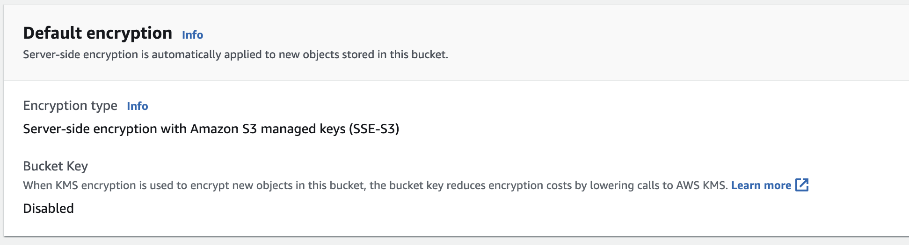

# BYOB

## About

Weights & Biases can connect to a S3 bucket created and owned by the customer. This is called BYOB (Bring your own bucket). More details (here)[https://docs.wandb.ai/guides/hosting/data-security/secure-storage-connector].

This example does not deploy a Weights & Biases instance. It deploys all required resources (S3 bucket and permissions) in the customer's account and grants the W&B AWS account access to them.

This module uses AE256 Encryption to protect the object store.

---

## Using Terraform

Terraform is the preferred method for deploying BYOB.

Infrastructure as code (IaC) tools allow you to manage infrastructure with
configuration files rather than through a graphical user interface. IaC
allows you to build, change, and manage your infrastructure in a safe,
consistent, and repeatable way by defining resource configurations that you
can version, reuse, and share.

1. Please follow the instructions for install [Terraform
   1.0+](https://learn.hashicorp.com/tutorials/terraform/install-cli)
2. Authenticated with Terraform with AWS. You can do this in many ways learn
   more
   [here](https://registry.terraform.io/providers/hashicorp/aws/latest/docs#authentication-and-configuration).
   It is most common to install and authenticate with [AWS
   CLI](https://docs.aws.amazon.com/cli/latest/userguide/cli-configure-quickstart.html).
3. Pull terraform-aws-wandb repo and cd to this
   [directory](https://github.com/wandb/terraform-aws-wandb/tree/main/examples/byob-sse-s3)
4. Run `terraform init`
5. Run `terraform apply`. If you need to assume a different role, please
   configure that in the `main.tf` file before running `apply`. You can learn
   more
   [here](https://registry.terraform.io/providers/hashicorp/aws/latest/docs#assuming-an-iam-role).
6. Please provide the resulting output to Weights & Biases (bucket name and kms arn)

## Using AWS Console

### SSE-S3 encryption

Amazon S3 now applies server-side encryption with Amazon S3 managed keys (SSE-S3)
as the base level of encryption for every bucket in Amazon S3. Starting January 5, 2023,
all new object uploads to Amazon S3 are automatically encrypted at no additional cost
and with no impact on performance. The automatic encryption status for S3 bucket default
encryption configuration and for new object uploads is available in AWS CloudTrail logs,
S3 Inventory, S3 Storage Lens, the Amazon S3 console, and as an additional Amazon S3 API
response header in the AWS Command Line Interface and AWS SDKs. For more information, see
[Default encryption FAQ](https://docs.aws.amazon.com/AmazonS3/latest/userguide/default-encryption-faq.html).

Do not configure a KMS key on the object store. Your configuration should look like this.

### Creating S3 Bucket

Please refer to the (public documentation)[https://docs.wandb.ai/guides/hosting/data-security/secure-storage-connector#provision-the-kms-key] on how to create all required resources manually.